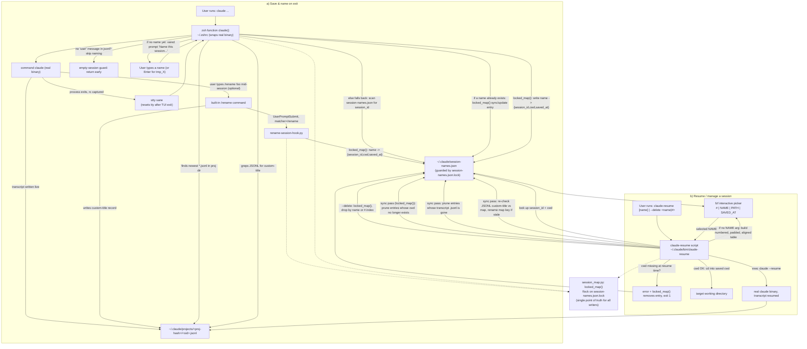

# Claude named-session save/resume — setup

Replicates: auto-prompt to name a Claude Code session on exit, and
`claude-resume` to pick it back up by name (or via an fzf picker).

## What's in this directory

```
Claude-save/
├── bin/claude-resume              -> ~/.claude/bin/claude-resume
├── lib/session_map.py             -> ~/.claude/lib/session_map.py
├── hooks/rename-session-hook.py   -> ~/.claude/hooks/rename-session-hook.py
├── zshrc-snippet.sh               -> append into ~/.zshrc
├── settings.hook-snippet.json     -> merge into ~/.claude/settings.json
├── SKILL.md                       -> Claude Code skill that does the install for you
├── architecture.mmd               -> mermaid diagram of the full save/resume flow
└── README.md
```

## Prerequisites

- `zsh` (the shell wrapper uses `vared`, a zsh builtin — won't work in bash)
- `python3` on `PATH`
- [`fzf`](https://github.com/junegunn/fzf) — `brew install fzf`
- Claude Code CLI installed and on `PATH` as `claude`

## Install — option A: via Claude Code skill (recommended)

This directory bundles `SKILL.md`, so Claude Code can do the whole install for you,
including the careful parts (merging settings.json instead of overwriting it, checking
for an existing `claude()` function before touching `.zshrc`).

1. Drop this whole directory at `~/.claude/skills/claude-resume-setup/` (keep the
   internal layout — `SKILL.md` must sit next to `bin/`, `lib/`, `hooks/`, etc.):
   ```bash
   mkdir -p ~/.claude/skills
   cp -r Claude-save ~/.claude/skills/claude-resume-setup
   ```
2. Start (or continue) any Claude Code session and say something like
   *"install claude-resume setup"* or *"set up named session resume on this machine"*.
3. Claude will check prerequisites, copy the runtime files, merge the settings.json
   hook, append the zshrc snippet (asking first if a `claude()` function already
   exists), and verify with `which claude-resume` / `type claude`.
4. Reload your shell (`source ~/.zshrc` or a new terminal) when it's done.

If you'd rather do it yourself line by line, or don't want to install the skill
permanently, follow option B instead.

## Install — option B: manual

1. **Copy the files into place:**

   ```bash
   mkdir -p ~/.claude/bin ~/.claude/lib ~/.claude/hooks
   cp bin/claude-resume     ~/.claude/bin/claude-resume
   cp lib/session_map.py    ~/.claude/lib/session_map.py
   cp hooks/rename-session-hook.py ~/.claude/hooks/rename-session-hook.py
   chmod +x ~/.claude/bin/claude-resume
   ```

2. **Wire the hook into `~/.claude/settings.json`.**

   Open `settings.hook-snippet.json` in this directory. If `~/.claude/settings.json`
   doesn't exist yet, just copy its `hooks` block in directly. If it already has a
   `hooks.UserPromptSubmit` array, append the one entry (the `{"matcher": "/rename", ...}`
   object) to that existing array instead of overwriting it — settings.json commonly has
   other unrelated hooks registered under the same event.

   Validate after editing:

   ```bash
   python3 -c "import json; json.load(open('$HOME/.claude/settings.json'))" && echo OK
   ```

3. **Append the shell wrapper to `~/.zshrc`.**

   Copy the contents of `zshrc-snippet.sh` to the end of `~/.zshrc`. It does two things:
   - adds `~/.claude/bin` to `PATH` (so `claude-resume` is callable directly)
   - defines a `claude()` function that shadows the real `claude` binary

   Then reload:

   ```bash
   source ~/.zshrc
   # or just open a new terminal
   ```

4. **Sanity check:**

   ```bash
   which claude-resume      # should resolve to ~/.claude/bin/claude-resume
   type claude               # should show the shell function, not just a binary path
   ```

## Architecture

Diagram source: [`architecture.mmd`](architecture.mmd).



## How it works

- Every time `claude` exits (the shell function, not the raw binary), it looks at the
  most recently modified `.jsonl` transcript for the project dir matching your launch
  `cwd`. If that transcript has at least one user message (empty/no-op sessions are
  skipped), it either:
  - finds an existing name for the session (via `/rename`'s `custom-title` record in
    the transcript, or a prior entry in `session-names.json`) and silently re-syncs it, or
  - prompts you interactively (`vared`) for a name, defaulting to `<dirname>-YYYY-MM-DD`
    (auto-suffixed `-A`/`-B`/... on collision), falling back to `tmp_X` on empty input.
- Names are stored in `~/.claude/session-names.json` as
  `name -> {session_id, cwd, saved_at}`. All writers (the shell function, the
  `/rename` hook, and `claude-resume`'s own sync pass) go through `session_map.py`'s
  `locked_map()`, which holds an `flock` on `session-names.json.lock` for the
  duration of each read-modify-write — prevents concurrent Claude sessions from
  clobbering each other's writes.
- `claude-resume [name]` re-syncs the map first (picks up `/rename` changes made
  mid-session, and prunes any entry whose saved `cwd` no longer exists or whose
  transcript file is gone), then either resumes `name` directly or, with no
  argument, shows an `fzf` picker (columns: `#`, `NAME`, `PATH`, `SAVED_AT`) and
  resumes whatever you select. It `cd`s into the session's saved directory before
  calling `claude --resume <session_id>`.
- `claude-resume --delete <name|#>` (or `-d`) removes an entry by name or by the
  `#` index shown in the picker.

## Files this setup creates at runtime (not part of the install)

- `~/.claude/session-names.json` — the name → session map (created on first save)
- `~/.claude/session-names.json.lock` — empty lock file used for `flock`

Neither needs to be pre-created; both appear automatically on first use.

## Known limitations

- `vared` requires `zsh`. There's no bash equivalent wired up.
- If `claude`'s TUI leaves the tty in a non-standard mode on exit, the shell
  function runs `stty sane` before reading anything — if a future Claude Code
  version changes this behavior and the naming prompt seems to hang, that's the
  first place to look.
